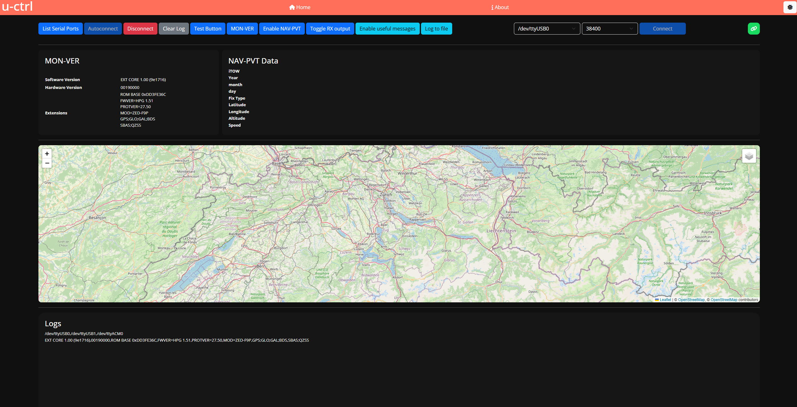

# u-ctrl
With this application it is possible to connect (automatically or manually) to a u-blox GNSS receiver. There is the option to enable the NAV-PVT message in case it is not enabled by default.
The NAV-PVT message needs to be enabled to show the position on the map. More features planned, WIP 🚧!
