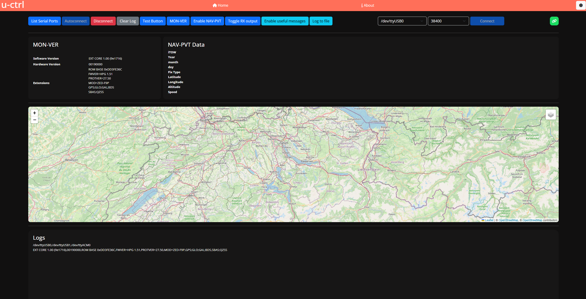

# u-ctrl
With this application it is possible to connect (automatically or manually) to a u-blox GNSS receiver. There is the option to enable the NAV-PVT message in case it is not enabled by default.
The NAV-PVT message needs to be enabled to show the position on the map. More features planned, WIP 🚧!


## Frontend Stack

The web UI now uses Vue 3 with Vite while keeping the existing Flask + Flask-SocketIO backend.

- Runtime integration: Flask templates + Vite-built Vue app mounted on the home page
- Realtime transport: Socket.IO event stream from backend to Vue state
- Map rendering: Leaflet with provider layers, driven by reactive NAV-PVT updates

Frontend source code now lives in `frontend/` with a modern Vue layout (`src/components`, `src/composables`, `src/services`).

## Frontend Development

Install frontend dependencies and build static assets:

```bash
cd frontend
npm install
npm run build
```

The build writes compiled files to `app/static/dist`, which are served by Flask templates.

For Vite local dev server:

```bash
cd frontend
npm run dev
```

## Docker Dev Profile (Hot Reload)

Run backend and Vite dev server together with Docker Compose profiles:

```bash
docker compose --profile dev up app-dev frontend-dev
```

Or use the Makefile shortcut:

```bash
make dev
```

Then open:

- Flask app: `http://localhost:5001`
- Vite dev server: `http://localhost:5173`

In this mode:

- Flask template loads Vite dev assets from `FRONTEND_DEV_SERVER_URL`
- Socket.IO CORS is enabled for `localhost:5173`
- Backend and frontend source files are bind-mounted for live edits
- `app-dev` waits for `frontend-dev` to become healthy before startup

Useful commands:

```bash
make dev-down
make dev-logs
make prod-up
make prod-down
```

## Development

Run the unit tests:

```bash
python -m pip install -U pip
python -m pip install -r requirements.txt
pytest -q
```

## Docker

Build the image locally:

```bash
docker build -t u-ctrl:local .
```

Run the container (exposes port 5001). Frontend assets are built during image build:

```bash
docker run --rm -p 5001:5001 u-ctrl:local
```

To override the SocketIO async mode (e.g. `threading`):

```bash
docker run --rm -e SOCKETIO_ASYNC_MODE=threading -p 5001:5001 u-ctrl:local
```

CI: A GitHub Actions workflow runs tests and builds a Docker image on push/PR to the default branches.
